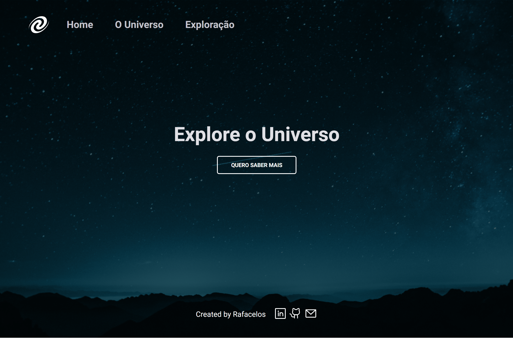
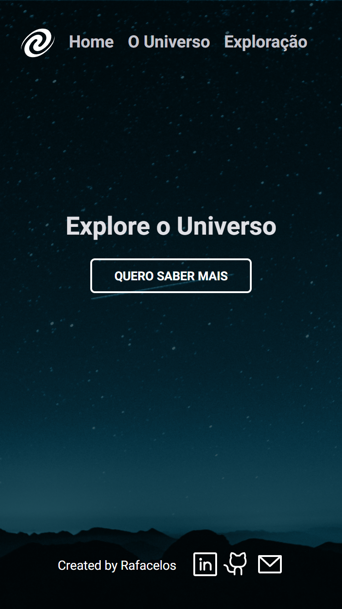

<h1 align="center"> Universe-SPA </h1>

 Deploy Link - https://rafacelos.github.io/Universe-SPA/

  Webpage about the Universe, build with the concept "Single Page Application".

  <a href="#-technologies">Technologies</a>&nbsp;&nbsp;&nbsp;|&nbsp;&nbsp;&nbsp;
  <a href="#-project">Project</a>&nbsp;&nbsp;&nbsp;|&nbsp;&nbsp;&nbsp;
  <a href="#-layout">Layout</a>&nbsp;&nbsp;&nbsp;|&nbsp;&nbsp;&nbsp;
  <a href="#memo-license">License</a>

  

 

  WeB

  

  Mobile

  

## 🚀 Technologies

This project was developed with the following technologies:

- HTML and CSS
- JavaScript ES6
- Node
- Lite-Server
- Figma

## 💻 Project

 The project is a interactive single page application. It can travel through content, using routes with javascript. This was a great exercise to practice how to build routes, classes and modelus, in javascript. 

## :memo: License

This project is under the MIT license.

---

Created with ♥ by Rafacelos :wave: [Talk to me on linkedin!](https://www.linkedin.com/in/rafaeloliveiradev)